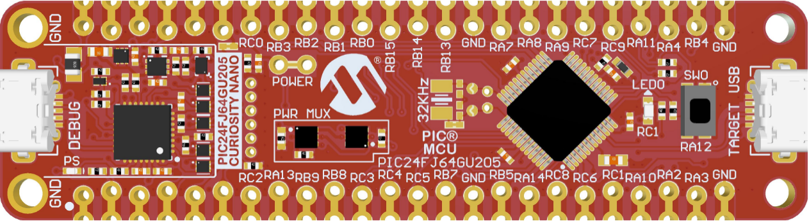
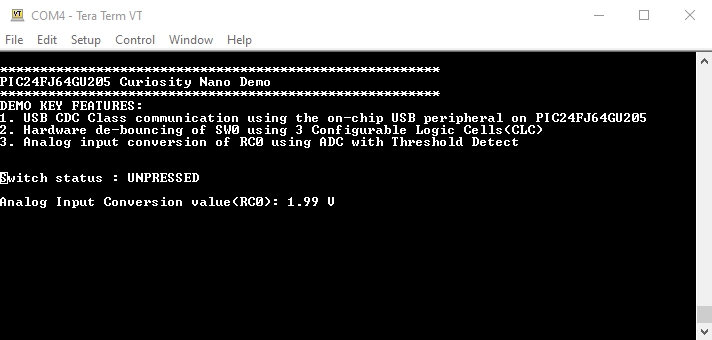

## PIC24FJ64GU205 Curiosity Nano Development Board - USB ADC CLC Demo

## Summary

LED on the board fades while the application is not
connected to the USB port.

When connected and the button (SW0) is pressed, the board will print the title "PIC24FJ64GU205 Curiosity Nano Demo" and key features of the demo followed by the status of Button : PRESSED/UNPRESSED and ADC conversion value (in V).

## Related Documentation

https://microchip.com/PIC24FJ64GU205

## Software Used

- A terminal program

## Hardware Used

- PIC24FJ64GU205 Curiosity Nano Development Board - https://www.microchip.com/EV10K72A
- Micro-USB cable (2 cables if programming/debugging)
- External Potentiometer or any analog signal

## Setup

- For programming/debugging the board, connect a micro-USB cable
  to the USB connector labeled "DEBUG"

- For running the demo, connect a micro-USB to the USB connector
  labeled "TARGET USB"

- Connect a Potentiometer or any analog signal to RC0 (AN10)

## Operation

- If the board is powered but not connected through the "TARGET
  USB" connector, then the LED on the board will fade on and
  off

- Select the COM port that appeared when the board was connected
  to the "TARGET USB" port. This will be unique on each
  computer

- If the board is connected through the "TARGET USB" port to a PC
  and the drivers have loaded successfully, the LED will be solid
  lit

- When connected, open a terminal program and press the push
  button on the board. This will print a message on the terminal
  screen

- The terminal shows the switch(SW0) status which is de-bounced output from CLC, followed by output from the ADC 

